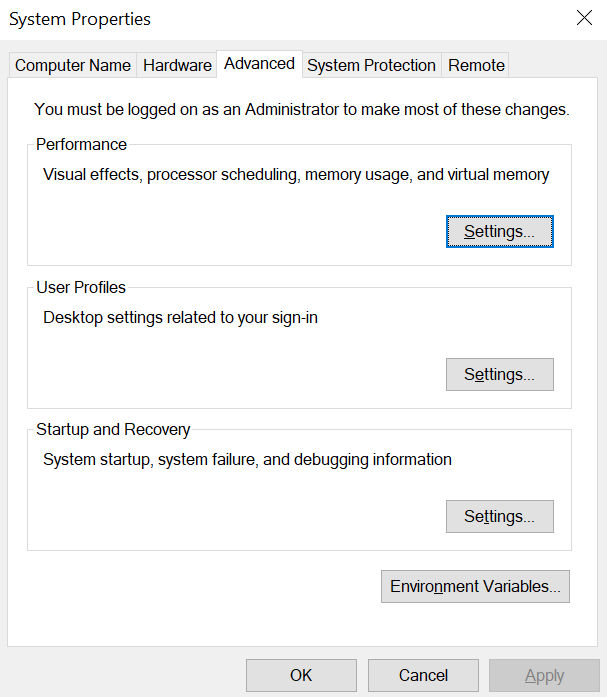

# Download and Install EvoMaster

_EvoMaster_ is composed of two main components:

* *Core*: the main program executable, packaged in a `evomaster.jar` file.
* *Driver*: library used to control and instrument the application under test.
            There is going to be one library per supported language/environment,
            like the JVM.
            Note: the driver is __NOT__ needed for [Black-Box Testing](./blackbox.md). 

The latest release of the `evomaster.jar` executable  can be downloaded from GitHub
 on the [releases page](https://github.com/EMResearch/EvoMaster/releases).
Alternatively, it can be built from [source code](./build.md).

Note: it does not matter where you download the jar file (e.g., your home folder, or the folder
of your project), as long as you can easily access it from a command-line terminal (e.g.,
to be able to execute `java -jar` on it).

Besides an uber-fat jar, since version 1.2.0 we also provide installers for Windows/OSX/Linux.
Note: the installers are built with `jpackage`, that currently does not have any simple, automated support to update 
 the [PATH environment variable](https://stackoverflow.com/questions/67784565/jpackage-update-path-environment-variable).
This means that, unless you want to type the full absolute path of where _EvoMaster_
gets installed each time you want to use it, you will need to update the PATH environmental variable by hand.
By default, _EvoMaster_ will get installed at:
* On Windows: `C:\Program Files\evomaster\evomaster.exe`
* On OSX: `/Applications/evomaster.app/Contents/MacOS/evomaster`
* On Linux: `/opt/evomaster/bin/evomaster`

On OSX and Linux, you can add to your `~/.bash_profile` file the following lines:

`export PATH="$PATH:/Applications/evomaster.app/Contents/MacOS"` (for OSX)

`export PATH="$PATH:/opt/evomaster/bin"` (for Linux)

Note that `~` refers to your home directory. 
If the file does not exist, you can create it for example with `touch ~/.bash_profile`.

For Windows, you need to go to the `System Properties`, and under `Advanced` tab click on `Environment Variables`.
Then, add the location of the folder in which _EvoMaster_ is installed (i.e., `C:\Program Files\evomaster`) to the `Path` variable (by selecting it, and then press `Edit`), as shown in the figures next. 

If you have not setup environment variables before, you can learn more by searching online with something like `set environment variable permanently` with the name of your operating system. 

Notice that these installer files are built with the latest versions
of these operating systems on GitHub Actions.
They might not work when trying to use these installers on older operating system versions.

Regarding the _driver_ library, it depends on the language/environment.
For example, the JVM support is available from [Maven Central](https://mvnrepository.com/artifact/org.evomaster). 
If you are building such library from [source code](./build.md), then make sure to
use the Maven `install` option to copy it over your local `~/.m2` repository.
You might also want to use `-DskipTests` the option. 
 
